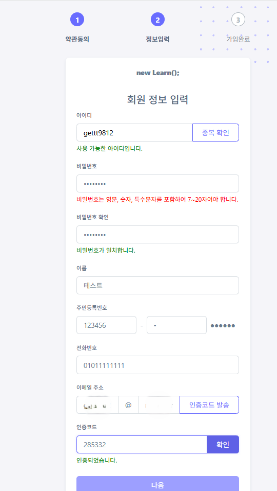
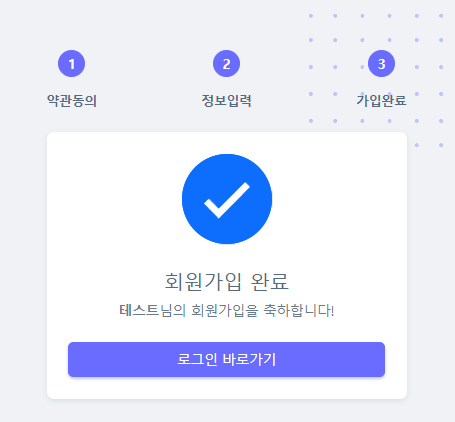
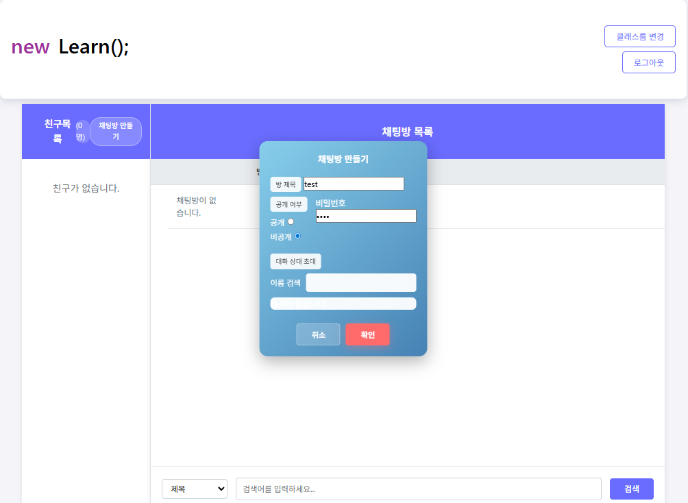
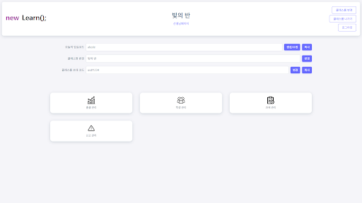
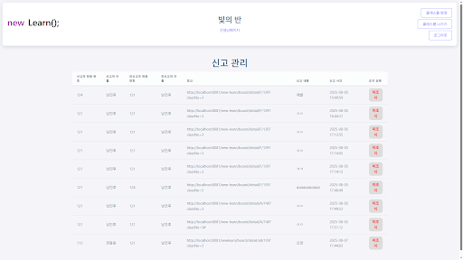
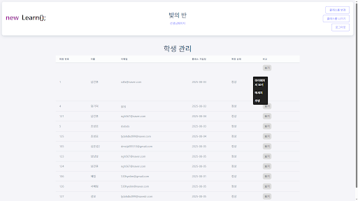
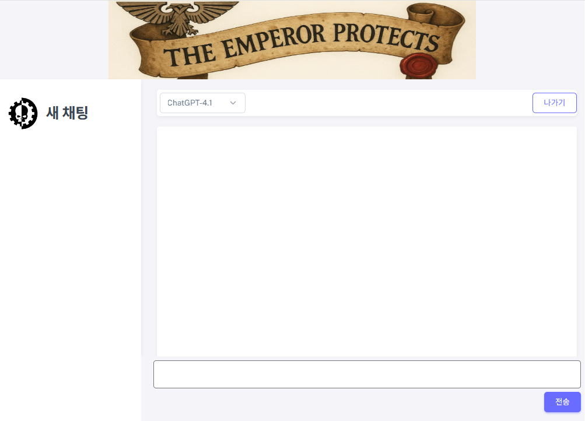
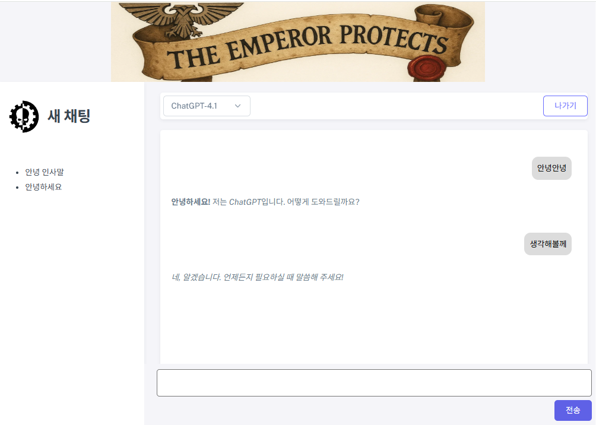
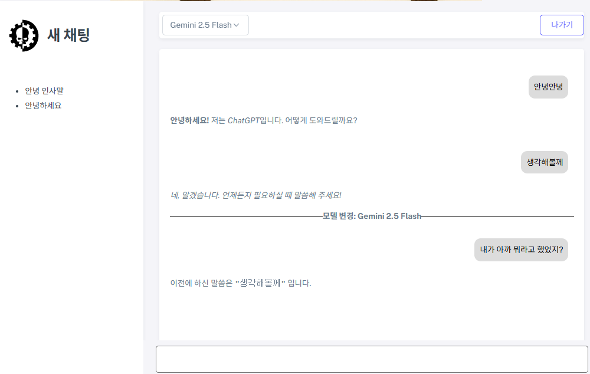

# new Learn();
**우리 반을 위한 소셜 미디어 클래스 플랫폼**

    https://github.com/kh-newlearn/new-learn
---
## 기술 스택(Tech Stack)

* **Language & Runtimes**: Java, JSP, JavaScript
* **Frameworks**: Spring, Spring Security
* **Data Access**: MyBatis
* **Database**: Oracle
* **Frontend**: HTML5, CSS3, jQuery
* **WAS(Web Application Server)**: Apache Tomcat
* **OS & Deployment**: Linux, AWS, Bitvise
* **Version Control**: Git, Sourcetree
* **Build & Tools**: Maven, Lombok
* **Collaboration & Design**: Slack, Figma, draw.io

---


## 1. 프로젝트 개요

본 프로젝트 **new Learn();**은 학생과 선생님의 원활한 소통과 학습 관리를 위해 개발된 Spring Legacy 기반의 소셜 미디어 등의 기능을 탑재한 **온라인 클래스 플랫폼**입니다.

회원가입 및 인증 시스템을 바탕으로, 게시판, 실시간 채팅, 캘린더 등 다양한 커뮤니티 및 학습 보조 기능을 통합하여 풍부한 사용자 경험을 제공하는 것이 주된 목표였습니다.


## 2. 주요 기능

본 플랫폼은 사용자의 역할(학생, 선생님, 관리자)에 따라 다음과 같은 핵심 기능을 제공합니다.

1. **회원 및 인증**
    * Spring Security와 'BCrypt' 암호화를 통한 **회원가입** 및 **로그인/로그아웃**
    * 이메일 인증, 실시간 유효성 검사를 포함한 **계정 정보 찾기** 및 **비밀번호 재설정**

2. **커뮤니티**
    * **게시판**: 공지, 질문, 자료 공유 등 사용자 목적에 따른 다목적 게시판
    * **공유 캘린더**: 반 전체의 학업 일정, 이벤트 등을 생성하고 공유
    * **실시간 소통**: WebSocket 기반의 개인/그룹 **채팅**, **음성 및 화면 공유** 기능
    * **"맥주 창고"**: 매일 8시 식당 메뉴 확인 가능

3. **개인 공간**
    * **개인 캘린더**: 사용자 개인의 **일정**을 등록하고 관리
    * **원격 저장소**: 개인 학습 자료를 위한 **클라우드 폴더** 기능
    * **출결 관리**: 접속 시간을 기반으로 한 **자동 출결 확인 및 알림**

4. **관리자 기능**
    * **통계 대시보드**: 서비스 주요 지표(방문자, 게시글, 신고 현황) 모니터링
    * **콘텐츠/사용자 관리**: 공지사항, 게시글, 사용자 계정(활동 정지 등) 관리
    * **신고 시스템**: 사용자의 신고 내역을 확인하고 처리하는 관리 기능

5. **AI 페이지**
    * **ChatGPT, Gemini**: 플랫폼 내에서 즉시 원하는 AI를 선택하여 사용 가능
    * **대화 연계 및 이전 채팅 불러오기**: 이전 채팅 목록의 제목을 클릭하여 대화를 이어나감 또한, AI 모델을 변경하더라도 대화가 리셋 되지 않고 **이어서 대화 가능**

## 3. 아키텍처 및 개발 과정

1. **클라이언트 영역**: 
    * 사용자는 PC, 태블릿 등 다양한 디바이스의 웹 브라우저를 통해 서비스에 접근합니다.
    * `Sneat` 템플릿을 기반으로 전체 페이지의 와이어프레임을 통일하고, `jsp:include`등을 활용하여 공통 컴포넌트를 분리하여 재사용성을 높였습니다.

2. **프론트엔드 & 백엔드 서버**:
    * **Web/WAS**: Apache Tomcat을 웹 애플리케이션 서버로 사용하며, AWS EC2 환경에 배포됩니다.
    * **Framework & Data Access**: Spring Framework를 기반으로 MVC 패턴을 적용하여 비즈니스 로직을 구현했으며, MyBatis를 통해 Oracle 데이터베이스와 연동합니다.
    * **Build & Dependency**: Maven을 통해 프로젝트의 의존성을 관리하고 빌드 과정을 자동화합니다.

3. **데이터베이스**:
    * **RDBMS**: Oracle Database를 주 데이터 저장소로 사용합니다. 데이터 베이스 역시 AWS RDS에 배포하여 데이터의 안정성, 확장성 및 관리 효율성을 확보했습니다.

4. **외부 API 연동**:
    * **AI 서비스**: 'AI 페이지' 기능 구현을 위해 ChatGPT 및 Gemini API와 연동하여 지능형 콘텐츠 생성 및 Q&A 등의 기능을 제공합니다.

5. 기타 개발 결정사항
    * **보안 아키텍처 수립**: Spring Security를 도입하여 인증/인가를 처리하고, URL 패턴을 세분화하여 각 기능에 필요한 최소한의 접근 권한만 부여하는 방식으로 보안을 강화했습니다.
    * **계층별 유효성 검사**: 프론트엔드에서는 jQuery/AJAX를 통해 실시간 비동기 검사를 구현하고, 백엔드에서는 Spring `Validator`를 이용해 서버단위에서 데이터를 한번 더 검증하는 2단계 유효성 검사 로직을 구축하여 데이터 무결성을 확보했습니다.


## 4. 데이터 모델

프로젝트의 데이터는 아래와 같은 테이블들로 구성되어 있으며, 각 테이블은 특정 기능 그룹을 지원합니다.
    <details>
    <summary><strong>데이터 모델 상세보기 (ERD 및 테이블 명세)</strong></summary>
    <div markdown="1">


    ### 회원 & 인증
    사용자의 계정 정보와 인증 상태를 관리합니다.

    **MEMBER** - 회원 정보 테이블
    | USER_NO | 회원 번호 (PK) |
    | USER_ID | 회원 아이디 (Unique) |
    | USER_PW | 암호화된 비밀번호 |
    | USER_NAME | 회원 이름 |
    | USER_ROLE | 사용자 권한 ('ROLE_USER', 'ROLE_TEACHER' 등) |
    | MEMBER_STATUS | 계정 상태 (Y: 활성, N: 정지) |

    **PERSISTENT_LOGINS** - '로그인 상태 유지' 토큰 정보
    | SERIES | 세션 식별 시리즈 (PK) |
    | USERNAME | 사용자 아이디 |
    | TOKEN | 인증 토큰 |
    | LAST_USED | 마지막 사용 시간 |

    ### 클래스 & 커뮤니티
    사용자들이 속한 클래스와 그 안에서의 활동(게시판, 과제 등) 데이터를 관리합니다.

    **CLASS** - 클래스(반) 정보
    | CLASS_NO | 클래스 번호 (PK) |
    | CLASS_NAME | 클래스 이름 |
    | TEACHER_NO | 담당 선생님 (MEMBER FK) |
    | CLASS_CODE | 클래스 참여 코드 (Unique) |

    **BOARD** - 게시판
    | BOARD_NO | 게시글 번호 (PK) |
    | CLASS_NO | 게시글이 속한 클래스 (CLASS FK) |
    | USER_NO | 작성자 (MEMBER FK) |
    | BOARD_TITLE | 게시글 제목 |
    | CATEGORY | 게시글 카테고리 |

    **REPLY** - 댓글
    | REPLY_NO | 댓글 번호 (PK) |
    | BOARD_NO | 원본 게시글 (BOARD FK) |
    | USER_NO | 작성자 (MEMBER FK) |

    **ASSIGNMENT** - 과제
    | ASSIGNMENT_NO | 과제 번호 (PK) |
    | CLASS_NO | 과제가 속한 클래스 (CLASS FK) |
    | ASSIGNMENT_TITLE | 과제 제목 |
    | END_DATE | 제출 마감일 |

    ### 마이페이지 & 개인 기능
    사용자 개인의 활동과 관련된 데이터를 관리합니다.

    **MYPAGE** - 마이페이지 정보
    | MYPAGE_NO | 마이페이지 번호 (PK) |
    | USER_NO | 소유자 (MEMBER FK) |
    | STATUS_MESSAGE | 상태 메시지 |

    **CALENDAR** - 캘린더 이벤트
    | EVENT_NO | 이벤트 번호 (PK) |
    | USER_NO | 생성자 (MEMBER FK) |
    | EVENT_NAME | 이벤트 이름 |
    | EVENT_TYPE | 이벤트 종류 (개인/공유) |

    **ATTENDANCE** - 출결 정보
    | ATT_NO | 출결 번호 (PK) |
    | USER_NO | 대상 학생 (MEMBER FK) |
    | ENTRY_TIME | 입실 시간 |
    | ATT_STATUS | 출결 상태 (출석, 지각 등) |

    ### 실시간 채팅
    WebSocket을 통해 구현된 채팅 기능의 데이터를 관리합니다.

    **CHAT_ROOM** - 채팅방 정보
    | CHAT_ROOM_NO | 채팅방 번호 (PK) |
    | CHAT_TITLE | 채팅방 제목 |
    | CHAT_PUBLIC | 공개 여부 (Y/N) |

    **CHAT_MESSAGE** - 채팅 메시지
    | MESSAGE_NO | 메시지 번호 (PK) |
    | CHAT_ROOM_NO | 채팅방 (CHAT_ROOM FK) |
    | USER_NO | 발신자 (MEMBER FK) |
    | CONTENT | 메시지 내용 |


## 5. 주요 화면

* **로그인 / 회원가입**
    * 
    * 
    *  

* **게시판 / 채팅**
    *
    *
    *

* **마이페이지**
    *
    *
    *

* **관리자 대시보드**
    *
    *
    *

* **AI 페이지**
    *
    *
    *


## 6. 프로젝트 실행 방법

```bash
0. 선행 조건
- IDE: STS(Spring Tool Suite) 또는 Eclipse
- JDK: Java 11
- Database: Oracle Database 11g Express Edition
- WAS: Apache Tomcat 9.0
- Build Tool: Maven
- Version Control: Git


1. Repository 복제
1) 프로젝트를 저장할 폴더로 이동 후, 아래 명렁어를 실행하여 프로젝트를 복제합니다.
git clone [https://github.com/kh-newlearn/new-learn.git] (https://github.com/kh-newlearn/new-learn.git)
2) 프로젝트 폴더로 이동합니다.
cd (new-learn)

2. 데이터베이스 설정
1) Oracle DB 접속: SQL Developer 등의 툴을 사용하여 DB에 접속합니다.
2) 계정 생성 및 권한 부여: 프로젝트에서 사용할 새 사용자 계정을 생성하고 권한을 부여합니다.
3) 스키마 생성: 프로젝트에 포함된 SQL 스키마 파일을 실행하여 모든 테이블과 시퀀스를 생성합니다.(미정)
4) DB 접속 정보 수정: 프로젝트 내의 DB 접속 정보 파일을 열어 2단계에서 생성한 DB 계정 정보에 맞게 수정합니다.(미정)

3. 프로젝트 불러오기 및 빌드
1) Import: Eclipse 또는 STS에서 File > Import... > Maven > Existing Maven Projects를 선택하고, 복제한 프로젝트 폴더를 선택하여 가져옵니다.
2) Build: 프로젝트를 가져오면 Maven이 pom.xml을 읽어 필요한 라이브러리들을 자동으로 다운로드합니다.

4. WAS(Tomcat) 연동
1) 서버 추가: STS의 Servers 뷰에서 Apache Tomcat 서버를 새로 추가하고, 로컬에 서리된 Tomcat 경로를 지정합니다.
2) 프로젝트 배포: 생성된 서버에 마우스 오른쪽 클릭 후 [Add and Remove...] 메뉴를 통해 new-learn 프로젝트를 추가합니다.

5. 프로젝트 실행
1) Servers 뷰에서 설정이 완료된 Tomcat 서버를 Start 시킵니다.
2) 서버 구동이 완료되었다면, 웹 브라우저를 열고 아래의 주소로 접속합니다.
http://localhost:8080/newlearn